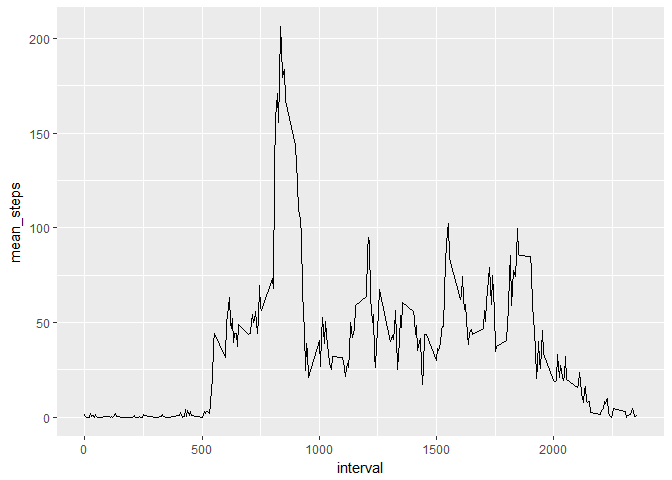

First Project On Reproducible Reaserch
======================================

Loading the activity.csv file

``` r
library(tidyverse)
```

    ## -- Attaching packages ---------------------------------------------------- tidyverse 1.2.1 --

    ## v ggplot2 2.2.1     v purrr   0.2.4
    ## v tibble  1.4.2     v dplyr   0.7.4
    ## v tidyr   0.8.0     v stringr 1.3.1
    ## v readr   1.1.1     v forcats 0.2.0

    ## Warning: package 'stringr' was built under R version 3.4.4

    ## -- Conflicts ------------------------------------------------------- tidyverse_conflicts() --
    ## x dplyr::filter() masks stats::filter()
    ## x dplyr::lag()    masks stats::lag()

``` r
activity <- read.csv("activity.csv", header = TRUE, sep = ",")
summary(activity)
```

    ##      steps                date          interval     
    ##  Min.   :  0.00   2012-10-01:  288   Min.   :   0.0  
    ##  1st Qu.:  0.00   2012-10-02:  288   1st Qu.: 588.8  
    ##  Median :  0.00   2012-10-03:  288   Median :1177.5  
    ##  Mean   : 37.38   2012-10-04:  288   Mean   :1177.5  
    ##  3rd Qu.: 12.00   2012-10-05:  288   3rd Qu.:1766.2  
    ##  Max.   :806.00   2012-10-06:  288   Max.   :2355.0  
    ##  NA's   :2304     (Other)   :15840

calculating the total no of steps taken per day and plotting them using histogram

``` r
activity_byDay <- activity %>% 
                       group_by(date)%>%
                       summarise(total_steps = sum(steps))

activity_byDay$date <- as.Date(activity_byDay$date)
ggplot(activity_byDay, aes(x = date, y = total_steps)) +
        geom_histogram(stat = "identity")
```

    ## Warning: Ignoring unknown parameters: binwidth, bins, pad

    ## Warning: Removed 8 rows containing missing values (position_stack).


claculating the mean and median off total no of steps taken per day

``` r
mean(activity_byDay$total_steps, na.rm = TRUE)
```

    ## [1] 10766.19

``` r
median(activity_byDay$total_steps, na.rm = TRUE)
```

    ## [1] 10765

``` r
activity_mean <- activity %>%
        group_by(interval) %>%
        summarise(mean_steps = mean(steps, na.rm = TRUE))
```

average steps over time series plot

``` r
ggplot(activity_mean, aes(x = interval, y = mean_steps)) +
        geom_line()
```

 calculating no of rows containing in activity data

``` r
sum(is.na(activity))
```

    ## [1] 2304

imputing the na vlaues using mean\_steps fill in the na containing rows

``` r
for(i in 1:nrow(activity)){
        if(is.na(activity$steps[i])){
                activity$steps[i] = activity_mean$mean_steps[which(activity_mean$interval == activity$interval[i])]
        }
}
sum(is.na(activity$steps))
```

    ## [1] 0

after imputing ploting the histogram of total no of steps per day

``` r
activity$date = as.Date(activity$date)
ggplot(activity, aes(x = date, y = steps))+
        geom_histogram(stat = "identity")
```

    ## Warning: Ignoring unknown parameters: binwidth, bins, pad

 mean and median of the total no of steps per day(after imputing)

``` r
newActivity_byDay <- activity %>% 
                       group_by(date)%>%
                       summarise(total_steps = sum(steps))

mean(newActivity_byDay$total_steps)
```

    ## [1] 10766.19

``` r
median(newActivity_byDay$total_steps)
```

    ## [1] 10766.19

creating new variable containing weekday and weekend

``` r
activity <- activity %>% mutate(typeofDay = ifelse(weekdays(activity$date) == "Saturday" | weekdays(activity$date) == "Sunday", "weekend", "weekday"))
table(activity$typeofDay)
```

    ## 
    ## weekday weekend 
    ##   12960    4608

``` r
newActivity_mean <- activity %>%
        group_by(interval, typeofDay) %>%
        summarise(mean_steps = mean(steps, na.rm = TRUE))
```

ploting the avg no of steps taken per each day using panels weekday and weekend

``` r
ggplot(newActivity_mean, aes(x = interval, y = mean_steps)) +
        geom_line() +
        facet_grid(typeofDay~.)
```


